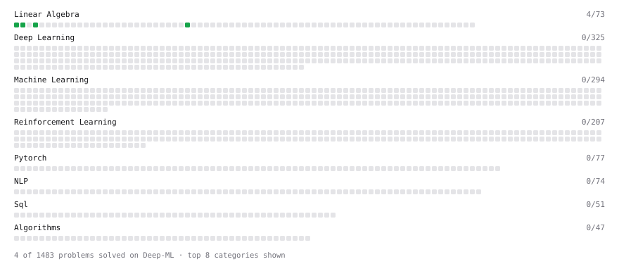

# Deep-ML — Machine Learning Fundamentals

Implementation-focused practice in machine learning, numerical methods and optimization using problems from [Deep-ML](https://www.deep-ml.com).

**15** solved · 15 problems · 0 labs · 0 math



[**Browse the interactive portfolio**](https://Davidkaaa33.github.io/deep-ml/)

## Purpose

This repository is the **fundamentals layer** of my ML portfolio.

The larger projects in my GitHub focus on end-to-end systems, APIs, evaluation pipelines and deployment. This repository focuses on a different question: **can I implement and reason about the mathematical and algorithmic building blocks underneath those systems?**

The emphasis is on:

- linear algebra operations used by ML models;
- regression and classification mechanics;
- activation functions;
- gradient-based optimization;
- regularization;
- implementation-level understanding rather than only calling high-level estimators.

Every submitted solution is written by hand.

---

## What is covered

| Area | Implementations in this repository |
| --- | --- |
| **Linear algebra** | matrix-vector product · transpose · row/column means · dot product · cosine similarity |
| **Regression** | normal equation · gradient-descent linear regression · R² |
| **Classification** | logistic prediction · single-neuron forward pass |
| **Activations** | sigmoid · numerically stabilized softmax |
| **Optimization** | batch / stochastic / mini-batch gradient descent · Adam |
| **Regularization** | L1 / Lasso with ISTA |

---

## Learning workflow

For each problem, the workflow is intentionally small and implementation-oriented:

```text
mathematical definition
        ↓
derive required operations
        ↓
implement the algorithm
        ↓
handle shapes / edge cases
        ↓
compare with expected behavior
        ↓
commit the solution
```

The objective is not to build a production system inside every exercise. The objective is to make the mechanics behind production ML abstractions explicit.

---

## Representative implementations

### Optimization

The repository includes implementations of:

- batch gradient descent;
- stochastic gradient descent;
- mini-batch gradient descent;
- Adam with first/second moment estimates;
- ISTA-style soft thresholding for L1 regularization.

These exercises reinforce the difference between an objective function, its gradient, an optimizer state, and the update rule applied at every iteration.

### Regression

Both the closed-form normal equation and iterative gradient-descent solution are represented, which makes the computational trade-off visible:

```text
closed-form solve
vs
iterative optimization
```

### Classification fundamentals

The logistic-regression exercise explicitly applies:

```text
linear score
   ↓
sigmoid
   ↓
probability
   ↓
0.5 threshold
   ↓
binary prediction
```

The single-neuron and activation-function exercises connect those operations to neural-network primitives.

---

## Repository structure

```text
problems/
├── 0001-matrix-vector-dot-product/
├── 0002-transpose-of-a-matrix/
├── ...
└── 0104-binary-classification-with-logistic-regression/

docs/                 interactive GitHub Pages portfolio
coverage.svg          generated progress visualization
README.md             progress + technical index
```

Each problem directory contains the implementation for one Deep-ML exercise.

---

## Solved problems

| Problem | Difficulty | Solved | Solution |
| --- | --- | --- | --- |
| [Binary Classification with Logistic Regression](https://www.deep-ml.com/problems/104) | easy | 2026-10-03 | [solution](problems/0104-binary-classification-with-logistic-regression) |
| [Calculate Cosine Similarity Between Vectors](https://www.deep-ml.com/problems/76) | easy | 2026-10-01 | [solution](problems/0076-calculate-cosine-similarity-between-vectors) |
| [Calculate Mean by Row or Column](https://www.deep-ml.com/problems/4) | easy | 2026-10-01 | [solution](problems/0004-calculate-mean-by-row-or-column) |
| [Calculate R-squared for Regression Analysis](https://www.deep-ml.com/problems/69) | easy | 2026-10-03 | [solution](problems/0069-calculate-r-squared-for-regression-analysis) |
| [Dot Product Calculator](https://www.deep-ml.com/problems/83) | easy | 2026-10-01 | [solution](problems/0083-dot-product-calculator) |
| [Linear Regression Using Gradient Descent](https://www.deep-ml.com/problems/15) | easy | 2026-10-03 | [solution](problems/0015-linear-regression-using-gradient-descent) |
| [Linear Regression Using Normal Equation](https://www.deep-ml.com/problems/14) | easy | 2026-10-03 | [solution](problems/0014-linear-regression-using-normal-equation) |
| [Matrix-Vector Dot Product](https://www.deep-ml.com/problems/1) | easy | 2026-09-30 | [solution](problems/0001-matrix-vector-dot-product) |
| [Sigmoid Activation Function Understanding](https://www.deep-ml.com/problems/22) | easy | 2026-10-01 | [solution](problems/0022-sigmoid-activation-function-understanding) |
| [Single Neuron](https://www.deep-ml.com/problems/24) | easy | 2026-10-01 | [solution](problems/0024-single-neuron) |
| [Softmax Activation Function Implementation](https://www.deep-ml.com/problems/23) | easy | 2026-10-01 | [solution](problems/0023-softmax-activation-function-implementation) |
| [Transpose of a Matrix](https://www.deep-ml.com/problems/2) | easy | 2026-09-30 | [solution](problems/0002-transpose-of-a-matrix) |
| [Implement Adam Optimization Algorithm](https://www.deep-ml.com/problems/49) | medium | 2026-10-03 | [solution](problems/0049-implement-adam-optimization-algorithm) |
| [Implement Gradient Descent Variants with MSE Loss](https://www.deep-ml.com/problems/47) | medium | 2026-10-03 | [solution](problems/0047-implement-gradient-descent-variants-with-mse-loss) |
| [Implement Lasso Regression using ISTA](https://www.deep-ml.com/problems/50) | medium | 2026-10-03 | [solution](problems/0050-implement-lasso-regression-using-ista) |

---

## Engineering around the practice repository

The repository also includes an interactive GitHub Pages view and a GitHub Actions workflow that normalizes the generated coverage visualization for GitHub's dark theme.

This is intentionally lighter than the production-oriented projects: the value here is the **algorithmic implementation evidence**, not artificial infrastructure around small exercises.

---

## Scope and limitations

These are focused educational implementations, not drop-in replacements for mature numerical or ML libraries.

Some solutions intentionally use NumPy or PyTorch primitives where the exercise is about a higher-level concept. Others implement the update logic more explicitly. The repository should therefore be read as evidence of progressive ML fundamentals practice rather than as a standalone ML product.

---

_Progress continues to evolve as new Deep-ML problems are solved._
